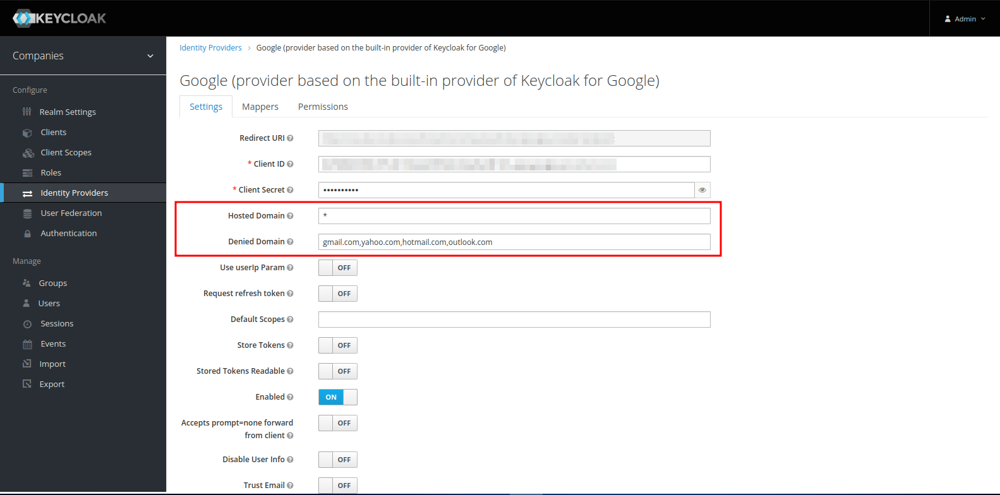

# Keycloak - Google Auth Provider

This project was developed to provide some features that are not available in the default Keycloak Google Social Auth Provider.

- `Hosted Domain` validation: It tells to Google to display only the accounts that are part of the specified domain. It accepts a list of domains separated by comma or the `*` character to allow any domain.

- `Denied Domain` validation: It verifies if the user's email is not part of the specified domain. It accepts a list of domains separated by comma. The authentication will fail if the user's email is part of any of the specified domains.



## Development

This provider was developed using:
- OpenJDK 11.0.17
- Maven 3.9.3

*We recommend using the same versions to avoid any issues.*

To make it easier to get started, we suggest using [ASDF](https://asdf-vm.com/#/core-manage-asdf-vm) to manage your Java and Maven versions.

## Build

To build the provider binary clone the repository and run the following command:

```bash
mvn clean install
```
*The `jar` file will be created in the `target` directory.*


## References
Keycloak Documentation

- [Service Provider Interfaces (SPI)](https://www.keycloak.org/docs/latest/server_development/#_providers)

- [Configuring providers
](https://www.keycloak.org/server/configuration-provider)

- [Authentication SPI](https://www.keycloak.org/docs/latest/server_development/#_auth_spi)


Custom Providers

- [Apple Identity Provider for Keycloak](https://github.com/klausbetz/apple-identity-provider-keycloak)

- [Keycloak-vk](https://github.com/zhkazarosian/keycloak-vk)