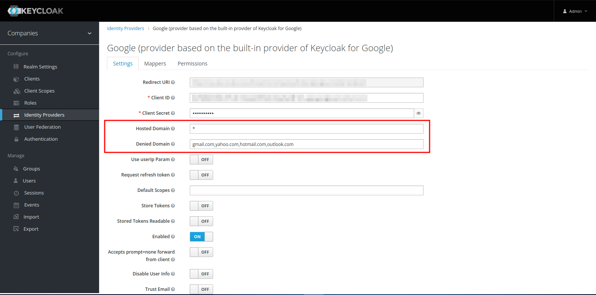

# Google Provider

This project was developed to provide some features that are not available in the built-in Google provider.

- `Hosted Domain` validation: It tells to Google to display only the accounts that are part of the specified domain. It accepts a list of domains separated by comma or the `*` character to allow any domain.

- `Denied Domain` validation: It verifies if the user's email is not part of the specified domain. It accepts a list of domains separated by comma. The authentication will fail if the user's email is part of any of the specified domains.




## Development

It was developed using:
- OpenJDK 11.0.17
- Maven 3.9.3


## Build

To build the provider binary clone the repository and run the following command:

```bash
mvn clean install
```
*The `jar` file will be created in the `target` directory.*

